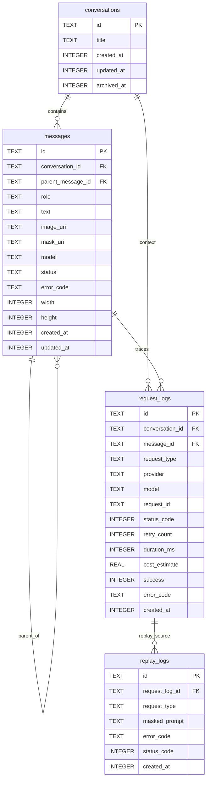

# 数据库 Schema 设计（MVP）

- 输入依据：`docs/PRD.md`、`docs/tech-stack.md`
- 数据库类型：SQLite（`expo-sqlite`）
- 目标：本地单机可用、可追踪、可恢复，不存 Base64 大对象

## 1. 集合与表

1. 集合（NoSQL）：无（MVP 不使用）
2. 表（SQL）：
- `conversations`
- `messages`
- `request_logs`
- `replay_logs`

## 2. 表定义（字段类型、约束、索引）

### 2.1 `conversations`
用途：会话主表，用于承载多轮对话上下文。

| 字段 | 类型 | 约束 | 说明 |
|---|---|---|---|
| `id` | `TEXT` | `PRIMARY KEY` | 会话 ID（UUID/ULID） |
| `title` | `TEXT` | `NOT NULL`, `CHECK length(trim(title)) > 0` | 会话标题 |
| `created_at` | `INTEGER` | `NOT NULL` | 创建时间戳（ms） |
| `updated_at` | `INTEGER` | `NOT NULL` | 更新时间戳（ms） |
| `archived_at` | `INTEGER` | 可空 | 归档时间戳（ms） |

索引：
- `idx_conversations_updated_at(updated_at DESC)`

### 2.2 `messages`
用途：消息与产图元数据；仅存文本和本地 URI，不存 Base64。

| 字段 | 类型 | 约束 | 说明 |
|---|---|---|---|
| `id` | `TEXT` | `PRIMARY KEY` | 消息 ID |
| `conversation_id` | `TEXT` | `NOT NULL`, `FK -> conversations(id) ON DELETE CASCADE` | 所属会话 |
| `parent_message_id` | `TEXT` | 可空, `FK -> messages(id) ON DELETE SET NULL` | 父消息（支持分叉） |
| `role` | `TEXT` | `NOT NULL`, `CHECK IN ('system','user','assistant')` | 消息角色 |
| `text` | `TEXT` | 可空 | 文本内容 |
| `image_uri` | `TEXT` | 可空, `CHECK image_uri LIKE 'file://%'` | 图片本地 URI |
| `mask_uri` | `TEXT` | 可空, `CHECK mask_uri LIKE 'file://%'` | Mask 本地 URI |
| `model` | `TEXT` | 可空 | 生成模型名 |
| `status` | `TEXT` | `NOT NULL`, `CHECK IN ('pending','running','succeeded','failed','cancelled')` | 任务状态 |
| `error_code` | `TEXT` | 可空 | 失败码 |
| `width` | `INTEGER` | 可空, `CHECK > 0` | 图片宽 |
| `height` | `INTEGER` | 可空, `CHECK > 0` | 图片高 |
| `created_at` | `INTEGER` | `NOT NULL` | 创建时间戳（ms） |
| `updated_at` | `INTEGER` | `NOT NULL` | 更新时间戳（ms） |

联合约束：
- `CHECK (text IS NOT NULL OR image_uri IS NOT NULL)`（至少有文本或图像）

索引：
- `idx_messages_conversation_created(conversation_id, created_at DESC)`
- `idx_messages_parent(parent_message_id)`
- `idx_messages_status(status)`

### 2.3 `request_logs`
用途：请求级可观测性（耗时、重试、成本、状态码）。

| 字段 | 类型 | 约束 | 说明 |
|---|---|---|---|
| `id` | `TEXT` | `PRIMARY KEY` | 日志 ID |
| `conversation_id` | `TEXT` | 可空, `FK -> conversations(id) ON DELETE SET NULL` | 关联会话 |
| `message_id` | `TEXT` | 可空, `FK -> messages(id) ON DELETE SET NULL` | 关联消息 |
| `request_type` | `TEXT` | `NOT NULL`, `CHECK IN ('prompt_enhance','image_generation','image_edit')` | 请求类型 |
| `provider` | `TEXT` | `NOT NULL DEFAULT 'siliconflow'` | 供应商 |
| `model` | `TEXT` | 可空 | 模型 |
| `request_id` | `TEXT` | 可空 | 上游请求标识 |
| `status_code` | `INTEGER` | 可空 | HTTP 状态码 |
| `retry_count` | `INTEGER` | `NOT NULL DEFAULT 0`, `CHECK >= 0` | 重试次数 |
| `duration_ms` | `INTEGER` | `NOT NULL`, `CHECK >= 0` | 耗时 |
| `cost_estimate` | `REAL` | `NOT NULL DEFAULT 0`, `CHECK >= 0` | 成本估算 |
| `success` | `INTEGER` | `NOT NULL`, `CHECK IN (0,1)` | 是否成功 |
| `error_code` | `TEXT` | 可空 | 失败码 |
| `created_at` | `INTEGER` | `NOT NULL` | 创建时间戳（ms） |

索引：
- `idx_request_logs_created(created_at DESC)`
- `idx_request_logs_type_created(request_type, created_at DESC)`
- `idx_request_logs_message(message_id)`

### 2.4 `replay_logs`
用途：失败回放（仅脱敏摘要，支持最近 N 条淘汰）。

| 字段 | 类型 | 约束 | 说明 |
|---|---|---|---|
| `id` | `TEXT` | `PRIMARY KEY` | 回放 ID |
| `request_log_id` | `TEXT` | 可空, `FK -> request_logs(id) ON DELETE SET NULL` | 关联请求日志 |
| `request_type` | `TEXT` | `NOT NULL`, `CHECK IN ('prompt_enhance','image_generation','image_edit')` | 请求类型 |
| `masked_prompt` | `TEXT` | `NOT NULL` | 脱敏提示词摘要 |
| `error_code` | `TEXT` | `NOT NULL` | 错误码 |
| `status_code` | `INTEGER` | 可空 | HTTP 状态码 |
| `created_at` | `INTEGER` | `NOT NULL` | 创建时间戳（ms） |

索引：
- `idx_replay_logs_created(created_at DESC)`
- `idx_replay_logs_type_created(request_type, created_at DESC)`

## 3. 表关系（ER 图）

## 4. 初始化 Migration

- 文件：`db/migrations/0001_initial_schema.sql`
- 内容：建表 + 外键 + 约束 + 索引 + 事务封装
- 执行说明：应用启动时按版本顺序执行，确保 `PRAGMA foreign_keys = ON`

## 5. 设计约束与实现注意

1. 严禁持久化 Base64：仅允许本地 `file://` URI 入库。
2. `replay_logs` 仅存脱敏文本，禁止原始 Prompt/Key。
3. 最近 N=50 回放淘汰建议在应用层通过定时清理实现。
4. 时间统一使用 Unix ms（`INTEGER`），避免跨端时区歧义。
