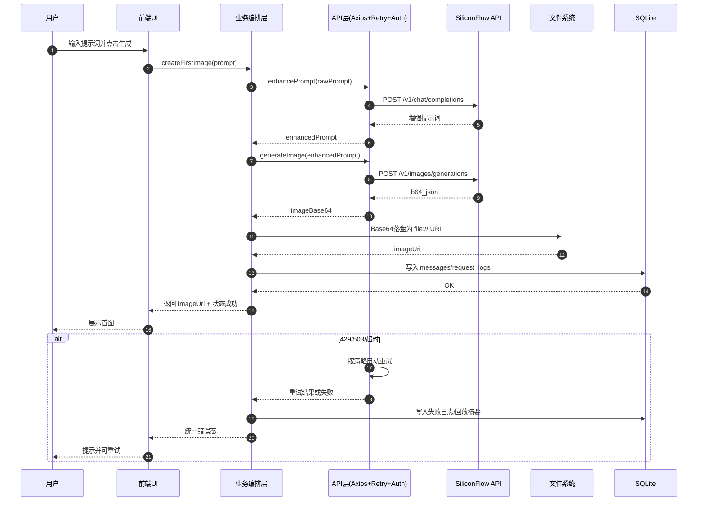
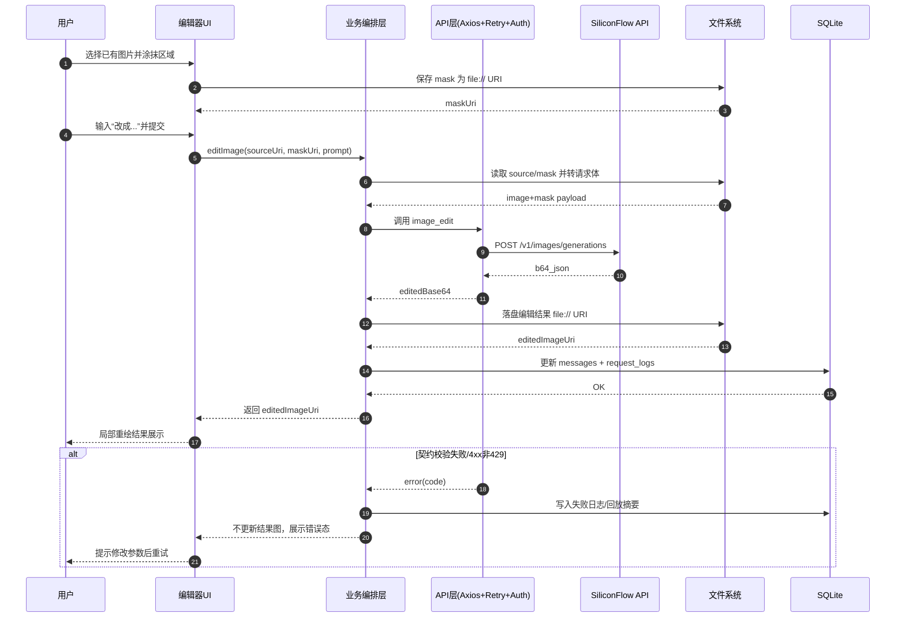

# 关键链路时序图（Mermaid）

## 1) 首图生成链路

```mermaid
sequenceDiagram
  autonumber
  participant U as 用户
  participant APP as 前端UI
  participant BL as 业务编排层
  participant API as API层(Axios+Retry+Auth)
  participant SF as SiliconFlow API
  participant FS as 文件系统
  participant DB as SQLite

  U->>APP: 输入提示词并点击生成
  APP->>BL: createFirstImage(prompt)
  BL->>API: enhancePrompt(rawPrompt)
  API->>SF: POST /v1/chat/completions
  SF-->>API: 增强提示词
  API-->>BL: enhancedPrompt

  BL->>API: generateImage(enhancedPrompt)
  API->>SF: POST /v1/images/generations
  SF-->>API: b64_json
  API-->>BL: imageBase64

  BL->>FS: Base64落盘为 file:// URI
  FS-->>BL: imageUri
  BL->>DB: 写入 messages/request_logs
  DB-->>BL: OK
  BL-->>APP: 返回 imageUri + 状态成功
  APP-->>U: 展示首图

  alt 429/503/超时
    API->>API: 按策略自动重试
    API-->>BL: 重试结果或失败
    BL->>DB: 写入失败日志/回放摘要
    BL-->>APP: 统一错误态
    APP-->>U: 提示并可重试
  end
```

## 2) 局部重绘链路

```mermaid
sequenceDiagram
  autonumber
  participant U as 用户
  participant APP as 编辑器UI
  participant BL as 业务编排层
  participant API as API层(Axios+Retry+Auth)
  participant SF as SiliconFlow API
  participant FS as 文件系统
  participant DB as SQLite

  U->>APP: 选择已有图片并涂抹区域
  APP->>FS: 保存 mask 为 file:// URI
  FS-->>APP: maskUri
  U->>APP: 输入“改成...”并提交

  APP->>BL: editImage(sourceUri, maskUri, prompt)
  BL->>FS: 读取 source/mask 并转请求体
  FS-->>BL: image+mask payload
  BL->>API: 调用 image_edit
  API->>SF: POST /v1/images/generations
  SF-->>API: b64_json
  API-->>BL: editedBase64

  BL->>FS: 落盘编辑结果 file:// URI
  FS-->>BL: editedImageUri
  BL->>DB: 更新 messages + request_logs
  DB-->>BL: OK
  BL-->>APP: 返回 editedImageUri
  APP-->>U: 局部重绘结果展示

  alt 契约校验失败/4xx非429
    API-->>BL: error(code)
    BL->>DB: 写入失败日志/回放摘要
    BL-->>APP: 不更新结果图，展示错误态
    APP-->>U: 提示修改参数后重试
  end
```
