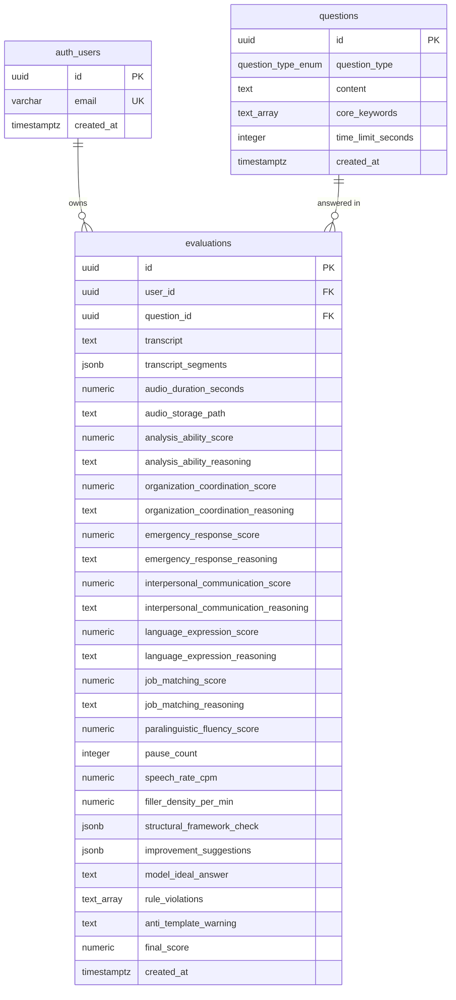

# 数据库 Schema 文档

**项目**：AI 面试训练系统（面试AI）
**数据库**：Supabase PostgreSQL 15
**迁移文件**：`db/migrations/001_init.sql`
**PRD 基准**：v1.5 §0.1、§0.4、§5.3、§6.4、§7.1

---

## ER 图



---

## 表：`questions`

**用途**：静态题库，6 大结构化面试题型（只读，不由用户写入）。PRD §0.1。

| 列名 | 类型 | 约束 | 说明 |
|------|------|------|------|
| `id` | `UUID` | PK, `DEFAULT gen_random_uuid()` | 题目唯一标识 |
| `question_type` | `question_type_enum` | NOT NULL | 题型枚举，见下方定义 |
| `content` | `TEXT` | NOT NULL, `char_length > 0` | 题目全文 |
| `core_keywords` | `TEXT[]` | NOT NULL, DEFAULT `'{}'` | 该题必选政策词汇，供 Aho-Corasick required 集合使用 |
| `time_limit_seconds` | `INTEGER` | NOT NULL, DEFAULT 180, BETWEEN 30–600 | 默认作答时限（秒） |
| `created_at` | `TIMESTAMPTZ` | NOT NULL, DEFAULT NOW() | 录入时间 |

### `question_type_enum` 枚举值

| 枚举值 | 中文题型 |
|--------|---------|
| `COMPREHENSIVE_ANALYSIS` | 综合分析题 |
| `PLANNING_ORGANIZATION` | 计划组织协调题 |
| `EMERGENCY_RESPONSE` | 应急应变题 |
| `INTERPERSONAL_RELATIONSHIPS` | 人际关系交往题 |
| `SELF_COGNITION` | 自我认知题 |
| `SCENARIO_SIMULATION` | 情景模拟题 |

---

## 表：`evaluations`

**用途**：每道题对应一条评估记录，append-only（无 UPDATE/DELETE）。PRD §0.4。

### 标识字段

| 列名 | 类型 | 约束 | 说明 |
|------|------|------|------|
| `id` | `UUID` | PK, DEFAULT gen_random_uuid() | 评估记录唯一标识 |
| `user_id` | `UUID` | NOT NULL, FK → `auth.users(id)` ON DELETE CASCADE | 用户 ID（Supabase Auth）|
| `question_id` | `UUID` | FK → `questions(id)` ON DELETE SET NULL | 题目 ID（题目删除后保留评估记录）|

### 音频管道结果

| 列名 | 类型 | 约束 | 说明 |
|------|------|------|------|
| `transcript` | `TEXT` | NOT NULL | Whisper 全文转写文本 |
| `transcript_segments` | `JSONB` | NOT NULL, DEFAULT `'[]'` | Whisper 词级时间戳数组，结构见下 |
| `audio_duration_seconds` | `NUMERIC(6,2)` | NOT NULL, `> 0` | 录音时长（秒）|
| `audio_storage_path` | `TEXT` | NULL | Supabase Storage 路径；TTL 24h Lifecycle Rule 自动删除 |

**`transcript_segments` JSONB 结构**：
```json
[
  {"text": "各位考官", "start": 0.0,  "end": 0.8},
  {"text": "关于这个问题", "start": 0.9, "end": 1.6}
]
```
每条段落对应前端高亮同步（`±0.5s` 容差，PRD §4.5）。

### 评分维度（维度 1–6，LLM 生成）

所有分值为 `NUMERIC(5,2)`，约束 `BETWEEN 0 AND 100`。LLM **不输出** `final_score`、`paralinguistic_fluency_score`。

| # | 字段前缀 | 权重 | 题型关联 |
|---|---------|------|---------|
| 1 | `analysis_ability` | 20% | 综合分析：点析对升四段论 |
| 2 | `organization_coordination` | 15% | 计划组织：定摸筹控结五步 |
| 3 | `emergency_response` | 15% | 应急应变：稳明调解报总六字诀 |
| 4 | `interpersonal_communication` | 15% | 人际交往：尊重服从、委婉沟通 |
| 5 | `language_expression` | 15% | 言语表达：流畅清晰、逻辑严密 |
| 6 | `job_matching` | 10% | 求职动机：忠诚度与岗位匹配 |

每个维度存两列：`<prefix>_score NUMERIC(5,2)` + `<prefix>_reasoning TEXT`。

### 维度 7：副语言流畅度（规则计算，非 LLM）

| 列名 | 类型 | 约束 | 说明 |
|------|------|------|------|
| `paralinguistic_fluency_score` | `NUMERIC(5,2)` | NOT NULL, BETWEEN **50** AND 100 | `calculate_fluency_score()` 输出，保底 50 分，PRD §7.1 |

**扣分规则（`calculate_fluency_score()` 内部逻辑）**：

| 扣分项 | 扣分值 | 上限 |
|--------|--------|------|
| 停顿 ≥ 3.0s（Whisper gap）| −2/次 | −10 |
| 语速 < 150 或 > 280 字/分钟 | −5 | — |
| 语气词密度 > 5 次/分钟 | −3 | — |

基础分 80，最终值 = `max(50, 80 − Σ扣分)`

### P1：副语言原始指标（趋势分析，PRD §2.2）

| 列名 | 类型 | 约束 | 说明 |
|------|------|------|------|
| `pause_count` | `INTEGER` | NULL, `>= 0` | 停顿次数（间隔 ≥ 3.0s）|
| `speech_rate_cpm` | `NUMERIC(6,2)` | NULL, `>= 0` | 语速（字/分钟）|
| `filler_density_per_min` | `NUMERIC(5,2)` | NULL, `>= 0` | 语气词密度（次/分钟）|

P1 字段可为 NULL（P1 功能未启用时不写入）。

### 结构化分析（LLM 生成，JSONB）

| 列名 | 类型 | 约束 | 说明 |
|------|------|------|------|
| `structural_framework_check` | `JSONB` | NOT NULL, 必含3键（见下） | 答题框架完整性检查 |
| `improvement_suggestions` | `JSONB` | NOT NULL, DEFAULT `'[]'` | 改进建议字符串数组 |
| `model_ideal_answer` | `TEXT` | NOT NULL | AI 生成的官方话语体系高分示范 |

**`structural_framework_check` JSONB 结构**（CHECK 约束验证三键必存在）：
```json
{
  "is_complete": false,
  "missing_elements": ["长效机制"],
  "present_elements": ["表明态度", "分析原因", "提出对策"]
}
```

### 规则红线与反模板化

| 列名 | 类型 | 约束 | 说明 |
|------|------|------|------|
| `rule_violations` | `TEXT[]` | NOT NULL, DEFAULT `'{}'`, 值域约束 | LLM 标注规则红线，`apply_rule_caps()` 输入 |
| `anti_template_warning` | `TEXT` | NULL | P1 正则黑名单检测结果；NULL = 未触发 |

**`rule_violations` 合法值集合**（CHECK `<@` 约束强制）：

| 值 | 硬钳制效果（`apply_rule_caps()`）|
|----|-------------------------------|
| `CLICHE_ANALYSIS` | `analysis_ability_score` ≤ 59 |
| `NO_SAFETY_PLAN` | `organization_coordination_score` ≤ 65 |
| `EMERGENCY_HARDLINE` | `emergency_response_score` ≤ 40 |
| `INTERPERSONAL_CONFLICT` | `interpersonal_communication_score` ≤ 40 |

**双保险机制**：LLM 标注 OR 确定性关键词检测任一命中均触发钳制（PRD §7.1）。

### 聚合与元数据

| 列名 | 类型 | 约束 | 说明 |
|------|------|------|------|
| `final_score` | `NUMERIC(5,2)` | NOT NULL, BETWEEN 0 AND 100 | 加权总分，后端硬编码计算，禁止 LLM 生成 |
| `created_at` | `TIMESTAMPTZ` | NOT NULL, DEFAULT NOW() | 评估创建时间 |

**`final_score` 加权公式**（PRD §0.3）：
```
final_score = round(
  analysis_ability_score            × 0.20 +
  organization_coordination_score   × 0.15 +
  emergency_response_score          × 0.15 +
  interpersonal_communication_score × 0.15 +
  language_expression_score         × 0.15 +
  job_matching_score                × 0.10 +
  paralinguistic_fluency_score      × 0.10,
  2
)
```
权重之和 = 1.00，后端 `InterviewResult.final_score()` 方法执行。

---

## 索引

| 索引名 | 表 | 列 | 类型 | 用途 |
|--------|----|----|------|------|
| `idx_evaluations_user_id` | evaluations | `user_id` | B-tree | RLS 过滤 + Dashboard 查询 |
| `idx_evaluations_user_created` | evaluations | `(user_id, created_at DESC)` | B-tree | 历史记录分页（最常用查询） |
| `idx_evaluations_question_id` | evaluations | `question_id` | B-tree | 按题目聚合分析 |
| `idx_questions_type` | questions | `question_type` | B-tree | 按题型随机抽题 |
| `idx_evaluations_framework_complete` | evaluations | `structural_framework_check` | GIN (`jsonb_path_ops`) | 框架完整率统计查询 |

---

## Row Level Security（RLS）

**`questions` 表**

| Policy | 操作 | 角色 | 条件 |
|--------|------|------|------|
| `questions_select_authenticated` | SELECT | authenticated | `true`（所有认证用户可读）|

**`evaluations` 表**

| Policy | 操作 | 角色 | 条件 |
|--------|------|------|------|
| `evaluations_select_own` | SELECT | authenticated | `auth.uid() = user_id` |
| `evaluations_insert_own` | INSERT | authenticated | `auth.uid() = user_id`（WITH CHECK）|

> **无 UPDATE / DELETE Policy**：`evaluations` 为 append-only，业务层禁止修改或删除评估记录。

> **FastAPI 服务端验证**：后端每个受保护路由通过 `supabase-py` `auth.get_user(token)` 验证 JWT（HS256，有效期 3600s），与 RLS 形成双重保障。

---

## Supabase Storage 配置（手动配置，不在 SQL 中执行）

| 配置项 | 值 | 说明 |
|--------|----|----|
| Bucket 名称 | `interview-audio` | 存储用户录音文件 |
| 访问控制 | Private | 仅后端 Service Role 可写 |
| Lifecycle Rule 条件 | 对象存在 > 86400s（24h）| PRD §5.3 数据安全约束 |
| Lifecycle Rule 动作 | 永久删除 | 满足录音 TTL ≤ 24h 要求 |

---

## 迁移执行说明

```bash
# 方式一：Supabase CLI（推荐）
supabase db push

# 方式二：直接执行 SQL
psql -h <SUPABASE_DB_HOST> -U postgres -d postgres -f db/migrations/001_init.sql

# 方式三：Supabase Dashboard SQL Editor
# 粘贴 001_init.sql 内容执行
```

**验证 Schema**（执行后确认）：
```sql
-- 确认枚举类型存在
SELECT typname FROM pg_type WHERE typname = 'question_type_enum';

-- 确认表与列数量
SELECT column_name, data_type
FROM information_schema.columns
WHERE table_name = 'evaluations'
ORDER BY ordinal_position;

-- 确认 RLS 已启用
SELECT tablename, rowsecurity
FROM pg_tables
WHERE tablename IN ('questions', 'evaluations');

-- 确认 Policy 数量（应为 3 条）
SELECT policyname, tablename, cmd
FROM pg_policies
WHERE tablename IN ('questions', 'evaluations');
```

---

## 字段来源速查

| 字段 | 来源 | PRD 依据 |
|------|------|---------|
| 6 个维度 `_score` + `_reasoning` | LLM（`beta.chat.completions.parse()`）| §0.2 |
| `structural_framework_check` | LLM | §0.2 |
| `improvement_suggestions` | LLM | §0.2 |
| `model_ideal_answer` | LLM | §0.2 |
| `rule_violations` | LLM（Pydantic 枚举校验）| §0.2、§7.1 |
| `paralinguistic_fluency_score` | 后端规则（`calculate_fluency_score()`）| §0.3、§7.1 |
| `pause_count` / `speech_rate_cpm` / `filler_density_per_min` | 后端规则（同上）| §2.2 P1 |
| `anti_template_warning` | 后端规则（正则黑名单）| §0.3、§7.2.5 P1 |
| `final_score` | 后端计算（`InterviewResult.final_score()`）| §0.3 |
| `transcript` / `transcript_segments` | Groq Whisper API | §0.4 |
| `audio_storage_path` | Supabase Storage 上传后写入 | §5.3 |
