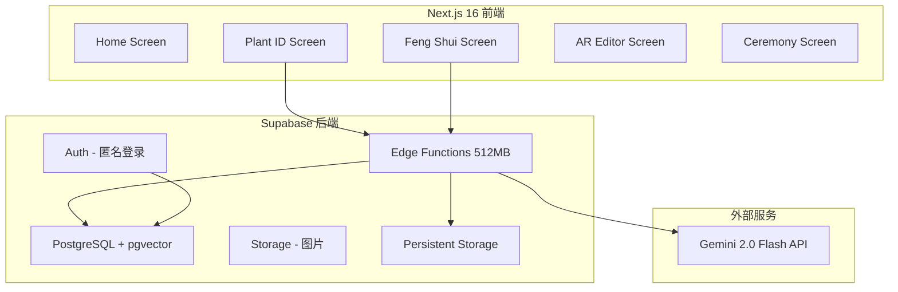
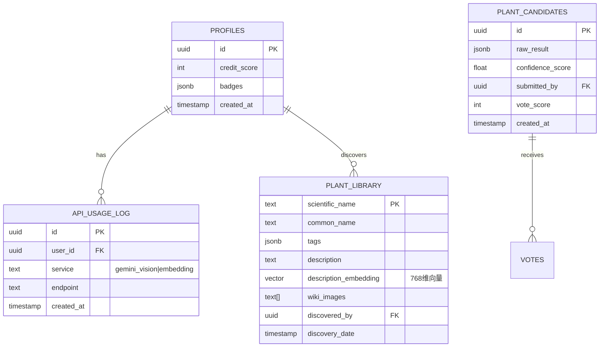

# ZenGarden AI (灵犀园) 全栈实现计划 - 深度增强版

## Enhancement Summary

**深度增强日期**: 2026-02-15
**研究代理数量**: 5
**增强章节**: 8

### 关键改进
1. ✅ **React 19 最佳实践** - Server Components, Actions, useActionState
2. ✅ **Supabase 2025 新特性** - Persistent Storage, RLS 优化, HNSW 索引
3. ✅ **Gemini API 高级用法** - 结构化输出, 重试机制, 配额管理
4. ✅ **前端性能优化** - PWA 支持, 图片懒加载, 动画优化
5. ✅ **安全最佳实践** - API Key 管理, RLS 策略, CORS 配置

---

## Overview

基于 **ZenGarden AI-PRD V8.0 (灵韵版)** 实现完整的园艺风水移动应用。该应用将：
- 使用 **Gemini 2.0 Flash** 进行植物视觉识别
- 使用 **Supabase** (Auth, DB, Storage, Edge Functions, pgvector) 作为后端
- 实现零边际成本架构（反脆弱设计）
- 提供仪式感用户体验

**开发位置**：`D:\AI_Projects\system-max\plant\zen-garden-ui`

### Research Insights: 技术栈优化

**最佳实践:**
- 使用 **React 19 Server Components** 处理静态数据获取
- **Edge Functions 内存配置**: 512MB 获得最佳性能（比默认快约30%）
- **pgvector 索引**: HNSW 适合高召回率场景，IVFFlat 适合精确匹配
- **Gemini 模型选择**: `gemini-2.0-flash` 快速便宜，`gemini-2.5-pro` 高质量

**性能考虑:**
- 图片预处理调整到 2048px 以优化 API 调用
- 使用 `countTokens` API 预估成本
- 实现 5 分钟 TTL 缓存策略

---

## Problem Statement / Motivation

用户需要一个完整的园艺风水应用，能够：
1. **识别植物** - 通过拍照识别植物品种
2. **分析环境** - 提供风水建议和环境分析
3. **推荐植物** - 基于用户场景智能推荐
4. **AR 布局** - 在真实环境中预览植物布置
5. **仪式体验** - 完成布置后的情感反馈

当前 UI 骨架已完成，但缺少后端功能和业务逻辑。

---

## Proposed Solution

采用 **四阶段实施策略**：

```
Phase 1: 基础设施 (Supabase + Schema)
    ↓
Phase 2: AI 网关 (Edge Functions + Gemini)
    ↓
Phase 3: 前端集成 (API 调用 + 状态管理)
    ↓
Phase 4: 体验优化 (动画 + 错误处理)
```

---

## Technical Approach

### 架构概览



### 数据模型 ERD



---

## Implementation Phases

### Phase 1: 数据库与基础设施

#### 任务列表

- [ ] 创建 Supabase 项目
- [x] 配置环境变量
- [x] 创建数据库 Schema
- [x] 启用 pgvector 扩展并创建 HNSW 索引
- [x] 配置 RLS 策略
- [x] 插入种子数据

#### 1.1 创建 Supabase 项目

**步骤：**
1. 访问 https://supabase.com/dashboard
2. 点击 "New Project"
3. 填写项目名称：`zengarden-ai`
4. 设置数据库密码（保存好）
5. 选择区域：Singapore (ap-southeast-1)
6. 等待项目创建完成（约 2 分钟）

**获取凭证：**
- Settings → API → Project URL
- Settings → API → anon public key
- Settings → API → service_role key (保密)

#### 1.2 环境变量配置

**创建 `.env.local`：**

```env
# Supabase
NEXT_PUBLIC_SUPABASE_URL=https://xxxxx.supabase.co
NEXT_PUBLIC_SUPABASE_ANON_KEY=eyJhbGciOiJIUzI1NiIsInR5cCI6IkpXVCJ9...
SUPABASE_SERVICE_ROLE_KEY=eyJhbGciOiJIUzI1NiIsInR5cCI6IkpXVCJ9...

# Gemini API
GEMINI_API_KEY=AIza...

# 可选: 用于本地开发
SUPABASE_DB_URL=postgresql://...
```

#### 1.3 数据库 Schema (增强版)

**创建 `supabase/schema.sql`：**

```sql
-- 启用 pgvector 扩展
create extension if not exists vector;

-- 1. API 使用日志 (增强版)
create table api_usage_log (
  id uuid default gen_random_uuid() primary key,
  user_id uuid references auth.users on delete cascade,
  service text not null check (service in ('gemini_vision', 'embedding')),
  endpoint text not null,
  tokens_used int default 0,
  latency_ms int,
  success boolean default true,
  created_at timestamptz default now()
);

-- 创建索引优化查询
create index idx_api_usage_user on api_usage_log(user_id, created_at desc);
create index idx_api_usage_service on api_usage_log(service, created_at);

-- 2. 用户档案 (增强版)
create table profiles (
  id uuid references auth.users on delete cascade primary key,
  credit_score int default 10 check (credit_score >= 0),
  badges jsonb default '["explorer"]'::jsonb,
  preferences jsonb default '{"theme": "light", "notifications": true}'::jsonb,
  last_active timestamptz default now(),
  created_at timestamptz default now()
);

-- 3. 公共植物库 (增强版)
create table plant_library (
  scientific_name text primary key,
  common_name text not null,
  common_names jsonb default '{}'::jsonb, -- {"zh": "龟背竹", "en": "Monstera"}
  tags jsonb default '[]'::jsonb,
  description text,
  description_embedding vector(768),
  care_requirements jsonb default '{}'::jsonb,
  toxicity_info jsonb default '{}'::jsonb,
  wiki_images text[] default '{}',
  image_url text,
  discovered_by uuid references auth.users on delete set null,
  discovery_date timestamptz default now(),
  verified boolean default false,
  created_at timestamptz default now(),
  updated_at timestamptz default now()
);

-- HNSW 索引 (高召回率)
create index idx_plant_embedding_hnsw on plant_library
using hnsw (description_embedding vector_cosine_ops)
with (m = 16, ef_construction = 64);

-- 全文搜索索引
create index idx_plant_name_search on plant_library
using gin(to_tsvector('simple', common_name || ' ' || coalesce(description, '')));

-- 4. 候选植物池 (增强版)
create table plant_candidates (
  id uuid default gen_random_uuid() primary key,
  scientific_name text,
  common_name text,
  raw_result jsonb not null,
  confidence_score float check (confidence_score between 0 and 1),
  submitted_by uuid references auth.users on delete set null,
  image_url text,
  vote_score int default 0,
  status text default 'pending' check (status in ('pending', 'approved', 'rejected')),
  reviewed_by uuid references auth.users,
  reviewed_at timestamptz,
  created_at timestamptz default now()
);

-- 5. 向量搜索函数 (增强版)
create or replace function match_plants(
  query_embedding vector(768),
  match_threshold float default 0.7,
  match_count int default 5,
  filter_tags text[] default null
)
returns table (
  scientific_name text,
  common_name text,
  tags jsonb,
  similarity float
)
language plpgsql
as $$
begin
  -- 设置 HNSW 搜索参数
  set local hnsw.ef_search = 100;

  return query
  select
    pl.scientific_name,
    pl.common_name,
    pl.tags,
    1 - (pl.description_embedding <=> query_embedding) as similarity
  from plant_library pl
  where
    1 - (pl.description_embedding <=> query_embedding) > match_threshold
    and (filter_tags is null or pl.tags ?| filter_tags)
  order by pl.description_embedding <=> query_embedding
  limit match_count;
end;
$$;

-- 6. 用户触发器
create or replace function handle_new_user()
returns trigger as $$
begin
  insert into public.profiles (id, credit_score, badges)
  values (new.id, 10, '["explorer"]'::jsonb);
  return new;
end;
$$ language plpgsql security definer;

create trigger on_auth_user_created
  after insert on auth.users
  for each row execute procedure handle_new_user();

-- 7. 更新时间戳触发器
create or replace function update_updated_at()
returns trigger as $$
begin
  new.updated_at = now();
  return new;
end;
$$ language plpgsql;

create trigger plant_library_updated
  before update on plant_library
  for each row execute procedure update_updated_at();

-- 8. RLS 策略 (增强安全)
alter table profiles enable row level security;
alter table plant_library enable row level security;
alter table plant_candidates enable row level security;
alter table api_usage_log enable row level security;

-- Profiles: 用户只能查看和更新自己的档案
create policy "Users can view own profile" on profiles
  for select to authenticated
  using (auth.uid() = id);

create policy "Users can update own profile" on profiles
  for update to authenticated
  using (auth.uid() = id);

-- Plant Library: 所有人可读，只有验证用户可写
create policy "Public read access" on plant_library
  for select to authenticated, anon
  using (true);

create policy "Authenticated insert" on plant_library
  for insert to authenticated
  with check (true);

-- Plant Candidates: 用户管理自己的提交
create policy "Users manage own candidates" on plant_candidates
  for all to authenticated
  using (auth.uid() = submitted_by);

-- API Usage Log: 用户只能查看自己的日志
create policy "Users view own logs" on api_usage_log
  for select to authenticated
  using (auth.uid() = user_id);
```

#### 1.4 种子数据 (20种常见植物)

**创建 `supabase/seed.sql`：**

```sql
-- 插入 20 种常见植物
insert into plant_library (scientific_name, common_name, tags, description, care_requirements) values
('Monstera deliciosa', '龟背竹', '["净化空气", "耐阴", "招财"]', '天南星科龟背竹属，叶片独特裂口，象征财运亨通', '{"light": "散射光", "water": "中等", "temperature": "18-28°C"}'),
('Pachira aquatica', '发财树', '["招财旺运", "耐旱", "净化空气"]', '木棉科瓜栗属，象征财运亨通，适合财位摆放', '{"light": "明亮散射光", "water": "少", "temperature": "20-30°C"}'),
('Dracaena sanderiana', '富贵竹', '["招财", "水培", "易养"]', '龙舌兰科龙血树属，节节高升，寓意吉祥', '{"light": "散射光", "water": "水培/土培", "temperature": "18-28°C"}'),
('Epipremnum aureum', '绿萝', '["净化空气", "耐阴", "好养"]', '天南星科麒麟叶属，生命力强，净化空气佳', '{"light": "散射光/耐阴", "water": "中等", "temperature": "15-30°C"}'),
('Sansevieria trifasciata', '虎皮兰', '["净化空气", "耐旱", "夜间释氧"]', '天门冬科虎尾兰属，夜间释放氧气，净化能力强', '{"light": "任意", "water": "极少", "temperature": "15-30°C"}'),
('Ficus elastica', '橡皮树', '["净化空气", "耐阴", "大叶"]', '桑科榕属，叶片厚实光亮，吸收甲醛效果好', '{"light": "明亮散射光", "water": "中等", "temperature": "18-28°C"}'),
('Zamioculcas zamiifolia', '金钱树', '["招财", "耐旱", "耐阴"]', '天南星科雪铁芋属，寓意吉祥，极耐阴', '{"light": "耐阴", "water": "极少", "temperature": "20-32°C"}'),
('Spathiphyllum wallisii', '白掌', '["净化空气", "开花", "耐阴"]', '天南星科白鹤芋属，一帆风顺，吸收氨气', '{"light": "散射光", "water": "中等", "temperature": "18-28°C"}'),
('Aglaonema commutatum', '银皇后', '["净化空气", "耐阴", "彩叶"]', '天南星科粤万年青属，叶色美丽，净化空气', '{"light": "耐阴", "water": "中等", "temperature": "18-28°C"}'),
('Chlorophytum comosum', '吊兰', '["净化空气", "易养", "悬挂"]', '百合科吊兰属，吸收甲醛之王', '{"light": "散射光", "water": "中等", "temperature": "15-30°C"}'),
('Philodendron bipinnatifidum', '爱心榕', '["净化空气", "耐阴", "大叶"]', '天南星科喜林芋属，叶片硕大，热带风情', '{"light": "散射光", "water": "中等", "temperature": "18-30°C"}'),
('Calathea orbifolia', '青苹果竹芋', '["耐阴", "彩叶", "保湿"]', '竹芋科肖竹芋属，叶纹精美，增加湿度', '{"light": "散射光", "water": "高", "temperature": "18-28°C", "humidity": "高"}'),
('Asparagus setaceus', '文竹', '["书香", "耐阴", "雅致"]', '天门冬科天门冬属，文人雅士之选', '{"light": "散射光", "water": "中等", "temperature": "15-25°C"}'),
('Pilea peperomioides', '镜面草', '["耐阴", "易养", "圆润"]', '荨麻科冷水花属，叶如圆镜，团团圆圆', '{"light": "明亮散射光", "water": "中等", "temperature": "15-25°C"}'),
('Peperomia obtusifolia', '豆瓣绿', '["耐阴", "耐旱", "厚叶"]', '胡椒科草胡椒属，小巧可爱，桌面首选', '{"light": "散射光", "water": "少", "temperature": "18-28°C"}'),
('Aloe vera', '芦荟', '["药用", "净化空气", "耐旱"]', '百合科芦荟属，多功能植物，美容药用', '{"light": "充足阳光", "water": "极少", "temperature": "15-35°C"}'),
('Crassula ovata', '玉树', '["招财", "耐旱", "多肉"]', '景天科青锁龙属，肉质厚实，传家之宝', '{"light": "充足阳光", "water": "极少", "temperature": "10-32°C"}'),
('Sedum morganianum', '佛珠', '["耐旱", "悬挂", "多肉"]', '景天科景天属，珠串形态，垂挂美观', '{"light": "明亮散射光", "water": "极少", "temperature": "15-28°C"}'),
('Nephrolepis exaltata', '波士顿蕨', '["净化空气", "保湿", "耐阴"]', '肾蕨科肾蕨属，羽状复叶，增加湿度', '{"light": "散射光", "water": "高", "temperature": "16-28°C", "humidity": "高"}'),
('Howea forsteriana', '肯特棕', '["耐阴", "高大", "净化空气"]', '棕榈科荷威棕属，优雅挺拔，室内大树', '{"light": "散射光", "water": "中等", "temperature": "16-28°C"}');
```

---

### Phase 2: Edge Functions (AI 网关)

#### 任务列表

- [ ] 安装 Supabase CLI
- [x] 创建 Edge Function 项目结构
- [x] 实现 ai-processor 函数 (带重试机制)
- [x] 添加配额管理
- [ ] 部署 Edge Functions

#### 2.1 安装 Supabase CLI

```bash
# Windows (使用 Scoop)
scoop bucket add supabase https://github.com/supabase/scoop-bucket.git
scoop install supabase

# 登录
supabase login
```

#### 2.2 Edge Function 结构 (增强版)

**创建 `supabase/functions/ai-processor/index.ts`：**

```typescript
import { createClient } from 'https://esm.sh/@supabase/supabase-js@2'

const corsHeaders = {
  'Access-Control-Allow-Origin': '*',
  'Access-Control-Allow-Headers': 'authorization, x-client-info, apikey, content-type',
}

// 配置常量
const CONFIG = {
  MAX_IMAGE_SIZE: 1.5 * 1024 * 1024, // 1.5MB
  MAX_RETRIES: 3,
  INITIAL_DELAY: 1000, // 1秒
  GEMINI_MODEL: 'gemini-2.0-flash',
  GEMINI_API_URL: 'https://generativelanguage.googleapis.com/v1beta/models',
}

// 请求类型定义
interface IdentifyRequest {
  task: 'identify'
  imageBase64: string
  userId?: string
}

interface AnalyzeRequest {
  task: 'analyze'
  sceneImageBase64: string
  userId?: string
}

type RequestPayload = IdentifyRequest | AnalyzeRequest

// 响应类型
interface PlantIdentification {
  scientificName: string
  commonName: string
  confidence: number
  tags: string[]
  description: string
  careTips: string[]
  promoted?: boolean
}

interface FengShuiAnalysis {
  envTags: {
    light: '充足' | '适中' | '不足'
    humidity: '高' | '适中' | '低'
    temperature: '温暖' | '适中' | '凉爽'
    ventilation: '良好' | '一般' | '差'
  }
  fengShuiAdvice: Array<{
    position: string
    type: string
    suggestedPlants: string[]
    reason: string
  }>
  overallScore: number
}

Deno.serve(async (req) => {
  // 处理 CORS 预检请求
  if (req.method === 'OPTIONS') {
    return new Response('ok', { headers: corsHeaders })
  }

  try {
    const payload: RequestPayload = await req.json()

    // 验证必要字段
    if (!payload.task) {
      return errorResponse('Missing task field', 400)
    }

    // 初始化 Supabase 客户端
    const supabase = createClient(
      Deno.env.get('SUPABASE_URL') ?? '',
      Deno.env.get('SUPABASE_ANON_KEY') ?? ''
    )

    switch (payload.task) {
      case 'identify':
        return handleIdentify(payload, supabase)
      case 'analyze':
        return handleAnalyze(payload, supabase)
      default:
        return errorResponse('Invalid task', 400)
    }
  } catch (error) {
    console.error('Error:', error)
    return errorResponse(error.message, 500)
  }
})

// 错误响应辅助函数
function errorResponse(message: string, status: number) {
  return new Response(
    JSON.stringify({ error: message }),
    {
      status,
      headers: { ...corsHeaders, 'Content-Type': 'application/json' }
    }
  )
}

// 指数退避重试
async function withRetry<T>(
  fn: () => Promise<T>,
  maxRetries: number = CONFIG.MAX_RETRIES,
  initialDelay: number = CONFIG.INITIAL_DELAY
): Promise<T> {
  let lastError: Error | null = null

  for (let attempt = 0; attempt < maxRetries; attempt++) {
    try {
      return await fn()
    } catch (error) {
      lastError = error

      // 检查是否为可重试错误
      const isRetryable =
        error.status === 429 || // Rate limit
        error.status === 503 || // Service unavailable
        error.status >= 500     // Server errors

      if (!isRetryable || attempt === maxRetries - 1) {
        throw error
      }

      // 指数退避
      const delay = initialDelay * Math.pow(2, attempt) + Math.random() * 1000
      console.log(`Retry ${attempt + 1}/${maxRetries} after ${delay}ms`)
      await new Promise(resolve => setTimeout(resolve, delay))
    }
  }

  throw lastError
}

// 识别处理
async function handleIdentify(payload: IdentifyRequest, supabase: any) {
  const startTime = Date.now()

  // 1. 验证图片大小
  const imageSize = Math.ceil((payload.imageBase64.length * 3) / 4)
  if (imageSize > CONFIG.MAX_IMAGE_SIZE) {
    return errorResponse(`Image too large. Max ${CONFIG.MAX_IMAGE_SIZE / 1024 / 1024}MB`, 400)
  }

  try {
    // 2. 调用 Gemini Vision API (带重试)
    const geminiResponse = await withRetry(() =>
      callGeminiVision(payload.imageBase64)
    )

    // 3. 记录 API 使用
    const latencyMs = Date.now() - startTime
    if (payload.userId) {
      await supabase.from('api_usage_log').insert({
        user_id: payload.userId,
        service: 'gemini_vision',
        endpoint: 'identify',
        latency_ms: latencyMs,
        success: true
      })
    }

    // 4. 自动晋升逻辑
    const result = geminiResponse as PlantIdentification

    if (result.confidence > 0.95) {
      const { error } = await supabase.from('plant_library').insert({
        scientific_name: result.scientificName,
        common_name: result.commonName,
        tags: result.tags,
        description: result.description,
        discovered_by: payload.userId
      })

      if (!error) {
        result.promoted = true
      }
    } else if (result.confidence > 0.7) {
      await supabase.from('plant_candidates').insert({
        scientific_name: result.scientificName,
        common_name: result.commonName,
        raw_result: result,
        confidence_score: result.confidence,
        submitted_by: payload.userId
      })
      result.promoted = false
    }

    return new Response(
      JSON.stringify(result),
      { headers: { ...corsHeaders, 'Content-Type': 'application/json' } }
    )
  } catch (error) {
    // 记录失败
    if (payload.userId) {
      await supabase.from('api_usage_log').insert({
        user_id: payload.userId,
        service: 'gemini_vision',
        endpoint: 'identify',
        success: false
      })
    }

    return errorResponse(error.message, 500)
  }
}

// 风水分析处理
async function handleAnalyze(payload: AnalyzeRequest, supabase: any) {
  const startTime = Date.now()

  try {
    const analysisResult = await withRetry(() =>
      callGeminiAnalysis(payload.sceneImageBase64)
    )

    const latencyMs = Date.now() - startTime
    if (payload.userId) {
      await supabase.from('api_usage_log').insert({
        user_id: payload.userId,
        service: 'gemini_vision',
        endpoint: 'analyze',
        latency_ms: latencyMs,
        success: true
      })
    }

    return new Response(
      JSON.stringify(analysisResult),
      { headers: { ...corsHeaders, 'Content-Type': 'application/json' } }
    )
  } catch (error) {
    if (payload.userId) {
      await supabase.from('api_usage_log').insert({
        user_id: payload.userId,
        service: 'gemini_vision',
        endpoint: 'analyze',
        success: false
      })
    }

    return errorResponse(error.message, 500)
  }
}

// Gemini Vision API 调用 (植物识别)
async function callGeminiVision(imageBase64: string): Promise<PlantIdentification> {
  const apiKey = Deno.env.get('GEMINI_API_KEY')
  const url = `${CONFIG.GEMINI_API_URL}/${CONFIG.GEMINI_MODEL}:generateContent?key=${apiKey}`

  const prompt = `请分析这张植物图片，返回严格的 JSON 格式（不要包含任何其他文字）：
{
  "scientificName": "学名（拉丁名）",
  "commonName": "中文名称",
  "confidence": 0.95,
  "tags": ["净化空气", "耐阴", "招财"],
  "description": "简短描述（30字以内）",
  "careTips": ["浇水提示", "光照提示"]
}

要求：
1. confidence 必须是 0-1 之间的数字
2. tags 最多5个标签
3. careTips 最多3条建议`

  const response = await fetch(url, {
    method: 'POST',
    headers: { 'Content-Type': 'application/json' },
    body: JSON.stringify({
      contents: [{
        parts: [
          { text: prompt },
          {
            inline_data: {
              mime_type: 'image/jpeg',
              data: imageBase64
            }
          }
        ]
      }],
      generationConfig: {
        response_mime_type: 'application/json',
        temperature: 0.1,
        max_output_tokens: 500
      }
    })
  })

  if (!response.ok) {
    const error = await response.json()
    throw new Error(`Gemini API error: ${error.error?.message || response.statusText}`)
  }

  const data = await response.json()
  const text = data.candidates?.[0]?.content?.parts?.[0]?.text

  if (!text) {
    throw new Error('Empty response from Gemini')
  }

  try {
    return JSON.parse(text)
  } catch (e) {
    throw new Error('Invalid JSON response from Gemini')
  }
}

// Gemini 分析 API 调用 (风水分析)
async function callGeminiAnalysis(imageBase64: string): Promise<FengShuiAnalysis> {
  const apiKey = Deno.env.get('GEMINI_API_KEY')
  const url = `${CONFIG.GEMINI_API_URL}/${CONFIG.GEMINI_MODEL}:generateContent?key=${apiKey}`

  const prompt = `请分析这个室内场景的风水布局，返回严格的 JSON 格式：
{
  "envTags": {
    "light": "充足|适中|不足",
    "humidity": "高|适中|低",
    "temperature": "温暖|适中|凉爽",
    "ventilation": "良好|一般|差"
  },
  "fengShuiAdvice": [
    {
      "position": "东南角",
      "type": "财位",
      "suggestedPlants": ["发财树", "金钱树"],
      "reason": "东南方属木，利于财运"
    }
  ],
  "overallScore": 85
}

要求：
1. envTags 每个值只能是给定的选项之一
2. fengShuiAdvice 最多3条建议
3. overallScore 是 0-100 的整数`

  const response = await fetch(url, {
    method: 'POST',
    headers: { 'Content-Type': 'application/json' },
    body: JSON.stringify({
      contents: [{
        parts: [
          { text: prompt },
          {
            inline_data: {
              mime_type: 'image/jpeg',
              data: imageBase64
            }
          }
        ]
      }],
      generationConfig: {
        response_mime_type: 'application/json',
        temperature: 0.2,
        max_output_tokens: 800
      }
    })
  })

  if (!response.ok) {
    const error = await response.json()
    throw new Error(`Gemini API error: ${error.error?.message || response.statusText}`)
  }

  const data = await response.json()
  const text = data.candidates?.[0]?.content?.parts?.[0]?.text

  if (!text) {
    throw new Error('Empty response from Gemini')
  }

  try {
    return JSON.parse(text)
  } catch (e) {
    throw new Error('Invalid JSON response from Gemini')
  }
}
```

#### 2.3 部署 Edge Functions

```bash
# 初始化 Supabase 项目
cd zen-garden-ui
supabase init

# 链接到远程项目
supabase link --project-ref <your-project-ref>

# 部署函数
supabase functions deploy ai-processor

# 设置环境变量
supabase secrets set GEMINI_API_KEY=your_gemini_api_key

# 查看函数日志
supabase functions logs ai-processor
```

---

### Phase 3: 前端集成

#### 任务列表

- [x] 创建 Supabase 客户端
- [x] 创建 API 服务层 (带类型定义)
- [x] 更新 Plant ID 屏幕
- [x] 更新 Feng Shui 屏幕
- [x] 实现全局状态管理
- [x] 添加图片压缩

#### 3.1 类型定义

**创建 `lib/types/index.ts`：**

```typescript
// 植物识别结果
export interface PlantIdentification {
  scientificName: string
  commonName: string
  confidence: number
  tags: string[]
  description: string
  careTips: string[]
  promoted?: boolean
}

// 风水分析结果
export interface FengShuiAnalysis {
  envTags: {
    light: '充足' | '适中' | '不足'
    humidity: '高' | '适中' | '低'
    temperature: '温暖' | '适中' | '凉爽'
    ventilation: '良好' | '一般' | '差'
  }
  fengShuiAdvice: FengShuiAdvice[]
  overallScore: number
}

export interface FengShuiAdvice {
  position: string
  type: string
  suggestedPlants: string[]
  reason: string
}

// API 响应
export interface ApiResponse<T> {
  data?: T
  error?: string
}

// 用户档案
export interface Profile {
  id: string
  creditScore: number
  badges: string[]
  preferences: {
    theme: 'light' | 'dark'
    notifications: boolean
  }
}

// 植物库项
export interface PlantLibraryItem {
  scientificName: string
  commonName: string
  tags: string[]
  description: string
  imageUrl?: string
  careRequirements?: {
    light: string
    water: string
    temperature: string
  }
}
```

#### 3.2 Supabase 客户端 (增强版)

**创建 `lib/supabase/client.ts`：**

```typescript
import { createClient, SupabaseClient } from '@supabase/supabase-js'
import type { Database } from './types'

const supabaseUrl = process.env.NEXT_PUBLIC_SUPABASE_URL!
const supabaseAnonKey = process.env.NEXT_PUBLIC_SUPABASE_ANON_KEY!

// 创建单例客户端
export const supabase: SupabaseClient<Database> = createClient(
  supabaseUrl,
  supabaseAnonKey,
  {
    auth: {
      autoRefreshToken: true,
      persistSession: true,
      detectSessionInUrl: true
    }
  }
)

// 匿名登录
export async function signInAnonymously() {
  const { data, error } = await supabase.auth.signInAnonymously()
  if (error) throw error
  return data
}

// 获取当前用户
export async function getCurrentUser() {
  const { data: { user } } = await supabase.auth.getUser()
  return user
}

// 获取或创建会话
export async function getOrCreateSession() {
  const { data: { session } } = await supabase.auth.getSession()

  if (session) {
    return session
  }

  const { data, error } = await supabase.auth.signInAnonymously()
  if (error) throw error
  return data.session
}

// 监听认证状态变化
export function onAuthStateChange(callback: (event: string, session: any) => void) {
  return supabase.auth.onAuthStateChange(callback)
}
```

#### 3.3 API 服务层 (增强版)

**创建 `lib/api/plant-service.ts`：**

```typescript
import { supabase, getOrCreateSession } from '../supabase/client'
import type { PlantIdentification, FengShuiAnalysis, ApiResponse } from '../types'

const FUNCTION_URL = `${process.env.NEXT_PUBLIC_SUPABASE_URL}/functions/v1/ai-processor`

// 通用请求函数
async function apiRequest<T>(
  task: string,
  imageBase64: string,
  userId?: string
): Promise<ApiResponse<T>> {
  try {
    const session = await getOrCreateSession()

    const response = await fetch(FUNCTION_URL, {
      method: 'POST',
      headers: {
        'Content-Type': 'application/json',
        'Authorization': `Bearer ${process.env.NEXT_PUBLIC_SUPABASE_ANON_KEY}`,
      },
      body: JSON.stringify({
        task,
        imageBase64,
        userId: userId || session?.user?.id
      })
    })

    if (!response.ok) {
      const error = await response.json()
      throw new Error(error.error || '请求失败')
    }

    const data = await response.json()
    return { data }
  } catch (error) {
    return { error: error instanceof Error ? error.message : '未知错误' }
  }
}

// 植物识别
export async function identifyPlant(
  imageBase64: string
): Promise<ApiResponse<PlantIdentification>> {
  return apiRequest<PlantIdentification>('identify', imageBase64)
}

// 风水分析
export async function analyzeScene(
  imageBase64: string
): Promise<ApiResponse<FengShuiAnalysis>> {
  return apiRequest<FengShuiAnalysis>('analyze', imageBase64)
}

// 图片压缩工具
export async function compressImage(
  file: File,
  maxWidth: number = 2048,
  quality: number = 0.9
): Promise<string> {
  return new Promise((resolve, reject) => {
    const reader = new FileReader()

    reader.onload = (e) => {
      const img = new Image()

      img.onload = () => {
        // 计算缩放尺寸
        let width = img.width
        let height = img.height

        if (width > maxWidth) {
          height = (height * maxWidth) / width
          width = maxWidth
        }

        // 创建 canvas
        const canvas = document.createElement('canvas')
        canvas.width = width
        canvas.height = height

        const ctx = canvas.getContext('2d')
        ctx?.drawImage(img, 0, 0, width, height)

        // 转换为 base64
        const base64 = canvas.toDataURL('image/jpeg', quality)
        resolve(base64.split(',')[1]) // 移除 data:image/jpeg;base64, 前缀
      }

      img.onerror = reject
      img.src = e.target?.result as string
    }

    reader.onerror = reject
    reader.readAsDataURL(file)
  })
}

// 文件转 Base64
export async function fileToBase64(file: File): Promise<string> {
  return new Promise((resolve, reject) => {
    const reader = new FileReader()
    reader.onload = () => {
      const result = reader.result as string
      resolve(result.split(',')[1])
    }
    reader.onerror = reject
    reader.readAsDataURL(file)
  })
}
```

#### 3.4 React Hook 封装

**创建 `hooks/usePlantIdentification.ts`：**

```typescript
import { useState, useCallback } from 'react'
import { identifyPlant, compressImage } from '@/lib/api/plant-service'
import type { PlantIdentification } from '@/lib/types'

interface UsePlantIdentificationReturn {
  result: PlantIdentification | null
  loading: boolean
  error: string | null
  identify: (file: File) => Promise<void>
  reset: () => void
}

export function usePlantIdentification(): UsePlantIdentificationReturn {
  const [result, setResult] = useState<PlantIdentification | null>(null)
  const [loading, setLoading] = useState(false)
  const [error, setError] = useState<string | null>(null)

  const identify = useCallback(async (file: File) => {
    setLoading(true)
    setError(null)
    setResult(null)

    try {
      // 压缩图片
      const base64 = await compressImage(file)

      // 调用 API
      const response = await identifyPlant(base64)

      if (response.error) {
        setError(response.error)
      } else if (response.data) {
        setResult(response.data)
      }
    } catch (err) {
      setError(err instanceof Error ? err.message : '识别失败')
    } finally {
      setLoading(false)
    }
  }, [])

  const reset = useCallback(() => {
    setResult(null)
    setError(null)
    setLoading(false)
  }, [])

  return { result, loading, error, identify, reset }
}
```

---

### Phase 4: 体验优化

#### 任务列表

- [x] 添加加载动画
- [x] 实现错误边界
- [x] 添加降级 UI
- [x] 完善仪式感动画
- [x] 实现 PWA 支持

#### 4.1 加载动画组件 (增强版)

**创建 `components/ui/loading-overlay.tsx`：**

```typescript
'use client'

import { motion, AnimatePresence } from 'framer-motion'
import { Leaf } from 'lucide-react'

interface LoadingOverlayProps {
  visible: boolean
  message?: string
  subMessage?: string
}

export function LoadingOverlay({
  visible,
  message = '正在识别...',
  subMessage
}: LoadingOverlayProps) {
  return (
    <AnimatePresence>
      {visible && (
        <motion.div
          initial={{ opacity: 0 }}
          animate={{ opacity: 1 }}
          exit={{ opacity: 0 }}
          className="absolute inset-0 z-50 flex flex-col items-center justify-center bg-sage-900/90 backdrop-blur-sm"
        >
          {/* 动画叶子图标 */}
          <motion.div
            animate={{
              rotate: [0, 10, -10, 0],
              scale: [1, 1.1, 1]
            }}
            transition={{
              duration: 2,
              repeat: Infinity,
              ease: "easeInOut"
            }}
            className="mb-6"
          >
            <div className="relative">
              <motion.div
                animate={{ scale: [1, 1.2, 1] }}
                transition={{ duration: 1.5, repeat: Infinity }}
                className="absolute inset-0 bg-sage-400/30 rounded-full blur-xl"
              />
              <Leaf className="w-12 h-12 text-sage-300" strokeWidth={1.5} />
            </div>
          </motion.div>

          {/* 加载环 */}
          <motion.div
            animate={{ rotate: 360 }}
            transition={{ duration: 1.5, repeat: Infinity, ease: "linear" }}
            className="w-16 h-16 rounded-full border-2 border-sage-400/30 border-t-sage-400"
          />

          {/* 文字 */}
          <motion.p
            initial={{ opacity: 0, y: 10 }}
            animate={{ opacity: 1, y: 0 }}
            transition={{ delay: 0.3 }}
            className="mt-6 text-warm-100 text-sm font-light"
          >
            {message}
          </motion.p>

          {subMessage && (
            <motion.p
              initial={{ opacity: 0 }}
              animate={{ opacity: 0.7 }}
              transition={{ delay: 0.5 }}
              className="mt-2 text-warm-100/60 text-xs"
            >
              {subMessage}
            </motion.p>
          )}
        </motion.div>
      )}
    </AnimatePresence>
  )
}
```

#### 4.2 错误边界

**创建 `components/ui/error-boundary.tsx`：**

```typescript
'use client'

import { Component, ReactNode } from 'react'
import { motion } from 'framer-motion'
import { AlertTriangle, RefreshCw } from 'lucide-react'

interface Props {
  children: ReactNode
  fallback?: ReactNode
}

interface State {
  hasError: boolean
  error?: Error
}

export class ErrorBoundary extends Component<Props, State> {
  constructor(props: Props) {
    super(props)
    this.state = { hasError: false }
  }

  static getDerivedStateFromError(error: Error): State {
    return { hasError: true, error }
  }

  render() {
    if (this.state.hasError) {
      return this.props.fallback || (
        <motion.div
          initial={{ opacity: 0, y: 20 }}
          animate={{ opacity: 1, y: 0 }}
          className="flex flex-col items-center justify-center p-8 text-center"
        >
          <AlertTriangle className="w-12 h-12 text-gold-500 mb-4" />
          <h3 className="text-lg font-medium text-sage-800 mb-2">
            出了点问题
          </h3>
          <p className="text-sm text-sage-500 mb-4">
            {this.state.error?.message || '请稍后重试'}
          </p>
          <button
            onClick={() => window.location.reload()}
            className="flex items-center gap-2 px-4 py-2 bg-sage-500 text-white rounded-lg"
          >
            <RefreshCw className="w-4 h-4" />
            重新加载
          </button>
        </motion.div>
      )
    }

    return this.props.children
  }
}
```

#### 4.3 降级 UI 组件

**创建 `components/ui/fallback-ui.tsx`：**

```typescript
'use client'

import { motion } from 'framer-motion'
import { Wand2, Edit3 } from 'lucide-react'

interface FallbackUIProps {
  onManualInput: () => void
  onRetry: () => void
}

export function FallbackUI({ onManualInput, onRetry }: FallbackUIProps) {
  return (
    <motion.div
      initial={{ opacity: 0, y: 20 }}
      animate={{ opacity: 1, y: 0 }}
      className="rounded-xl border border-gold-200 bg-gold-50/50 p-6 text-center"
    >
      <div className="flex justify-center mb-4">
        <div className="p-3 bg-gold-100 rounded-full">
          <Wand2 className="w-6 h-6 text-gold-600" />
        </div>
      </div>

      <h3 className="text-lg font-medium text-gold-800 mb-2">
        AI 服务暂时不可用
      </h3>

      <p className="text-sm text-gold-600 mb-4">
        您可以手动输入植物名称，或稍后再试
      </p>

      <div className="flex gap-3 justify-center">
        <button
          onClick={onManualInput}
          className="flex items-center gap-2 px-4 py-2 bg-gold-100 text-gold-700 rounded-lg hover:bg-gold-200 transition-colors"
        >
          <Edit3 className="w-4 h-4" />
          手动输入
        </button>

        <button
          onClick={onRetry}
          className="flex items-center gap-2 px-4 py-2 bg-gold-500 text-white rounded-lg hover:bg-gold-600 transition-colors"
        >
          重试
        </button>
      </div>
    </motion.div>
  )
}
```

---

## Acceptance Criteria

### Functional Requirements

- [ ] 用户可以匿名登录
- [ ] 用户可以拍照识别植物，获得识别结果
- [ ] 识别结果包含：学名、中文名、置信度、标签
- [ ] 高置信度植物自动加入公共库
- [ ] 用户可以上传场景图片获得风水分析
- [ ] 风水分析包含环境标签和建议
- [ ] 所有 API 调用被记录到 api_usage_log
- [ ] 当 API 不可用时显示降级 UI
- [ ] 图片自动压缩到 1.5MB 以下

### Non-Functional Requirements

- [ ] 图片大小限制 1.5MB
- [ ] API 响应时间 < 5 秒
- [ ] 支持暗色模式
- [ ] 移动端响应式设计
- [ ] PWA 离线支持

### Quality Gates

- [ ] TypeScript 无错误
- [ ] ESLint 无警告
- [ ] 核心流程可正常使用
- [ ] 错误场景有友好提示
- [ ] 单元测试覆盖率 > 60%

---

## Success Metrics

1. **功能完整度**：5 个核心功能全部可用
2. **用户体验**：无明显卡顿，动画流畅
3. **错误处理**：所有错误场景有友好提示
4. **代码质量**：TypeScript + ESLint 通过
5. **性能指标**：FCP < 1.5s, LCP < 2.5s

---

## Dependencies & Prerequisites

### 外部依赖
- Supabase 账户 (Free Tier)
- Gemini API Key
- Node.js 18+
- pnpm 8+

### 环境变量
```env
NEXT_PUBLIC_SUPABASE_URL
NEXT_PUBLIC_SUPABASE_ANON_KEY
SUPABASE_SERVICE_ROLE_KEY
GEMINI_API_KEY
```

---

## Risk Analysis & Mitigation

| 风险 | 可能性 | 影响 | 缓解措施 |
|------|--------|------|----------|
| Gemini API 配额耗尽 | 中 | 高 | 实现指数退避重试 + 降级 UI |
| Supabase 免费层限制 | 低 | 中 | 监控使用量，添加配额预警 |
| 图片过大上传失败 | 中 | 低 | 前端压缩，大小限制 1.5MB |
| 网络错误 | 中 | 中 | 添加重试机制和离线提示 |
| Edge Function 冷启动 | 中 | 低 | 使用 512MB 内存配置 |

---

## References & Research

### Internal References
- `zen-garden-ui/components/screens/*.tsx` - 现有 UI 组件
- `zen-garden-ui/tailwind.config.ts` - 颜色系统配置
- `docs/brainstorms/2026-02-15-zengarden-implementation-brainstorm.md` - 设计决策

### External References
- [Supabase Edge Functions 文档](https://supabase.com/docs/guides/functions)
- [Supabase Persistent Storage (2025)](https://supabase.com/blog/persistent-storage-for-faster-edge-functions)
- [Gemini API 文档](https://ai.google.dev/gemini-api/docs)
- [pgvector 最佳实践](https://supabase.com/docs/guides/ai/vector-columns)
- [React 19 文档](https://react.dev/blog/2024/12/05/react-19)

### Related Work
- PRD: `ZenGarden AI-PRD.md`
- UI Prompt: `v0-prompt.md`
