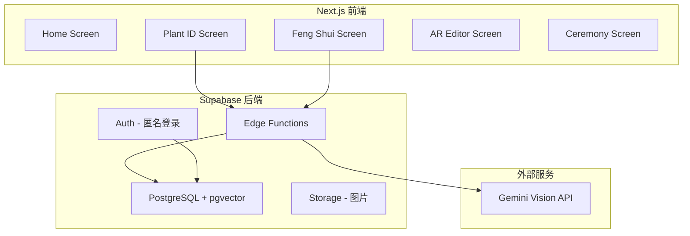
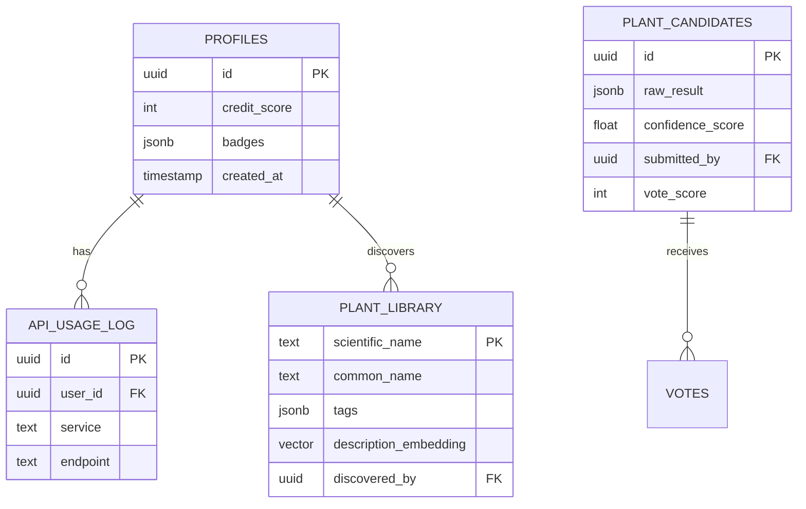

# ZenGarden AI (灵犀园) 全栈实现计划

## Overview

基于 **ZenGarden AI-PRD V8.0 (灵韵版)** 实现完整的园艺风水移动应用。该应用将：
- 使用 **Gemini 1.5 Flash** 进行植物视觉识别
- 使用 **Supabase** (Auth, DB, Storage, Edge Functions, pgvector) 作为后端
- 实现零边际成本架构（反脆弱设计）
- 提供仪式感用户体验

**开发位置**：`D:\AI_Projects\system-max\plant\zen-garden-ui`

## Problem Statement / Motivation

用户需要一个完整的园艺风水应用，能够：
1. **识别植物** - 通过拍照识别植物品种
2. **分析环境** - 提供风水建议和环境分析
3. **推荐植物** - 基于用户场景智能推荐
4. **AR 布局** - 在真实环境中预览植物布置
5. **仪式体验** - 完成布置后的情感反馈

当前 UI 骨架已完成，但缺少后端功能和业务逻辑。

## Proposed Solution

采用 **四阶段实施策略**：

```
Phase 1: 基础设施 (Supabase + Schema)
    ↓
Phase 2: AI 网关 (Edge Functions + Gemini)
    ↓
Phase 3: 前端集成 (API 调用 + 状态管理)
    ↓
Phase 4: 体验优化 (动画 + 错误处理)
```

## Technical Approach

### 架构概览



### 数据模型 ERD



## Implementation Phases

### Phase 1: 数据库与基础设施

#### 任务列表

- [ ] 创建 Supabase 项目
- [ ] 配置环境变量
- [ ] 创建数据库 Schema
- [ ] 启用 pgvector 扩展
- [ ] 插入种子数据

#### 1.1 创建 Supabase 项目

**步骤：**
1. 访问 https://supabase.com/dashboard
2. 点击 "New Project"
3. 填写项目名称：`zengarden-ai`
4. 设置数据库密码（保存好）
5. 选择区域：Singapore (ap-southeast-1)
6. 等待项目创建完成（约 2 分钟）

**获取凭证：**
- Settings → API → Project URL
- Settings → API → anon public key
- Settings → API → service_role key (保密)

#### 1.2 环境变量配置

**创建 `.env.local`：**

```env
# Supabase
NEXT_PUBLIC_SUPABASE_URL=https://xxxxx.supabase.co
NEXT_PUBLIC_SUPABASE_ANON_KEY=eyJhbGciOiJIUzI1NiIsInR5cCI6IkpXVCJ9...
SUPABASE_SERVICE_ROLE_KEY=eyJhbGciOiJIUzI1NiIsInR5cCI6IkpXVCJ9...

# Gemini API
GEMINI_API_KEY=AIza...
```

#### 1.3 数据库 Schema

**创建 `supabase/schema.sql`：**

```sql
-- 启用 pgvector 扩展
create extension if not exists vector;

-- 1. API 使用日志
create table api_usage_log (
  id uuid default gen_random_uuid() primary key,
  user_id uuid references auth.users,
  service text not null,  -- 'gemini_vision' | 'embedding'
  endpoint text,
  created_at timestamp default now()
);

-- 2. 用户档案
create table profiles (
  id uuid references auth.users primary key,
  credit_score int default 10,
  badges jsonb default '[]'::jsonb,
  created_at timestamp default now()
);

-- 3. 公共植物库
create table plant_library (
  scientific_name text primary key,
  common_name text,
  tags jsonb,
  description text,
  description_embedding vector(768),
  wiki_images text[],
  discovered_by uuid references auth.users,
  discovery_date timestamp default now()
);

-- 4. 候选植物池
create table plant_candidates (
  id uuid default gen_random_uuid() primary key,
  raw_result jsonb,
  confidence_score float,
  submitted_by uuid references auth.users,
  vote_score int default 0,
  created_at timestamp default now()
);

-- 5. 向量搜索函数
create or replace function match_plants(
  query_embedding vector(768),
  match_threshold float default 0.7,
  match_count int default 5
)
returns table (
  scientific_name text,
  common_name text,
  tags jsonb,
  similarity float
)
language plpgsql
as $$
begin
  return query
  select
    pl.scientific_name,
    pl.common_name,
    pl.tags,
    1 - (pl.description_embedding <=> query_embedding) as similarity
  from plant_library pl
  where 1 - (pl.description_embedding <=> query_embedding) > match_threshold
  order by pl.description_embedding <=> query_embedding
  limit match_count;
end;
$$;

-- 6. 为匿名用户创建默认档案
create or replace function handle_new_user()
returns trigger as $$
begin
  insert into public.profiles (id, credit_score, badges)
  values (new.id, 10, '["explorer"]'::jsonb);
  return new;
end;
$$ language plpgsql security definer;

create trigger on_auth_user_created
  after insert on auth.users
  for each row execute procedure handle_new_user();
```

#### 1.4 种子数据

**创建 `supabase/seed.sql`：**

```sql
-- 插入 20 种常见植物
insert into plant_library (scientific_name, common_name, tags, description) values
('Monstera deliciosa', '龟背竹', '["净化空气", "耐阴", "招财"]', '天南星科龟背竹属，叶片独特裂口'),
('Pachira aquatica', '发财树', '["招财旺运", "耐旱", "净化空气"]', '木棉科瓜栗属，象征财运亨通'),
('Dracaena sanderiana', '富贵竹', '["招财", "水培", "易养"]', '龙舌兰科龙血树属，节节高升'),
('Epipremnum aureum', '绿萝', '["净化空气", "耐阴", "好养"]', '天南星科麒麟叶属，生命力强'),
('Sansevieria trifasciata', '虎皮兰', '["净化空气", "耐旱", "夜间释氧"]', '天门冬科虎尾兰属，净化能力强'),
('Ficus elastica', '橡皮树', '["净化空气", "耐阴", "大叶"]', '桑科榕属，叶片厚实光亮'),
('Zamioculcas zamiifolia', '金钱树', '["招财", "耐旱", "耐阴"]', '天南星科雪铁芋属，寓意吉祥'),
('Spathiphyllum wallisii', '白掌', '["净化空气", "开花", "耐阴"]', '天南星科白鹤芋属，一帆风顺'),
('Aglaonema commutatum', '银皇后', '["净化空气", "耐阴", "彩叶"]', '天南星科粤万年青属，叶色美丽'),
('Chlorophytum comosum', '吊兰', '["净化空气", "易养", "悬挂"]', '百合科吊兰属，吸收甲醛'),
('Philodendron bipinnatifidum', '爱心榕', '["净化空气", "耐阴", "大叶"]', '天南星科喜林芋属，叶片硕大'),
('Calathea orbifolia', '青苹果竹芋', '["耐阴", "彩叶", "保湿"]', '竹芋科肖竹芋属，叶纹精美'),
('Asparagus setaceus', '文竹', '["书香", "耐阴", "雅致"]', '天门冬科天门冬属，文人雅士'),
('Pilea peperomioides', '镜面草', '["耐阴", "易养", "圆润"]', '荨麻科冷水花属，叶如圆镜'),
('Peperomia obtusifolia', '豆瓣绿', '["耐阴", "耐旱", "厚叶"]', '胡椒科草胡椒属，小巧可爱'),
('Aloe vera', '芦荟', '["药用", "净化空气", "耐旱"]', '百合科芦荟属，多功能植物'),
('Crassula ovata', '玉树', '["招财", "耐旱", "多肉"]', '景天科青锁龙属，肉质厚实'),
('Sedum morganianum', '佛珠', '["耐旱", "悬挂", "多肉"]', '景天科景天属，珠串形态'),
('Nephrolepis exaltata', '波士顿蕨', '["净化空气", "保湿", "耐阴"]', '肾蕨科肾蕨属，羽状复叶'),
('Howea forsteriana', '肯特棕', '["耐阴", "高大", "净化空气"]', '棕榈科荷威棕属，优雅挺拔');
```

---

### Phase 2: Edge Functions (AI 网关)

#### 任务列表

- [ ] 安装 Supabase CLI
- [ ] 创建 Edge Function 项目结构
- [ ] 实现 ai-processor 函数
- [ ] 部署 Edge Functions

#### 2.1 安装 Supabase CLI

```bash
# Windows (使用 Scoop)
scoop bucket add supabase https://github.com/supabase/scoop-bucket.git
scoop install supabase

# 登录
supabase login
```

#### 2.2 Edge Function 结构

**创建 `supabase/functions/ai-processor/index.ts`：**

```typescript
import { createClient } from 'https://esm.sh/@supabase/supabase-js@2'

const corsHeaders = {
  'Access-Control-Allow-Origin': '*',
  'Access-Control-Allow-Headers': 'authorization, x-client-info, apikey, content-type',
}

interface IdentifyRequest {
  task: 'identify'
  imageBase64: string
  userId?: string
}

interface AnalyzeRequest {
  task: 'analyze'
  sceneImageBase64: string
  userId?: string
}

type RequestPayload = IdentifyRequest | AnalyzeRequest

Deno.serve(async (req) => {
  // 处理 CORS 预检请求
  if (req.method === 'OPTIONS') {
    return new Response('ok', { headers: corsHeaders })
  }

  try {
    const payload: RequestPayload = await req.json()

    // 初始化 Supabase 客户端
    const supabase = createClient(
      Deno.env.get('SUPABASE_URL') ?? '',
      Deno.env.get('SUPABASE_ANON_KEY') ?? ''
    )

    switch (payload.task) {
      case 'identify':
        return handleIdentify(payload, supabase)
      case 'analyze':
        return handleAnalyze(payload, supabase)
      default:
        return new Response(
          JSON.stringify({ error: 'Invalid task' }),
          { status: 400, headers: { ...corsHeaders, 'Content-Type': 'application/json' } }
        )
    }
  } catch (error) {
    return new Response(
      JSON.stringify({ error: error.message }),
      { status: 500, headers: { ...corsHeaders, 'Content-Type': 'application/json' } }
    )
  }
})

async function handleIdentify(payload: IdentifyRequest, supabase: any) {
  // 1. 检查图片大小 (< 1.5MB)
  const imageSize = Math.ceil((payload.imageBase64.length * 3) / 4)
  if (imageSize > 1.5 * 1024 * 1024) {
    return new Response(
      JSON.stringify({ error: 'Image too large. Max 1.5MB' }),
      { status: 400, headers: { ...corsHeaders, 'Content-Type': 'application/json' } }
    )
  }

  // 2. 调用 Gemini Vision API
  const geminiResponse = await callGeminiVision(payload.imageBase64)

  // 3. 记录 API 使用
  if (payload.userId) {
    await supabase.from('api_usage_log').insert({
      user_id: payload.userId,
      service: 'gemini_vision',
      endpoint: 'identify'
    })
  }

  // 4. 自动晋升逻辑
  const result = geminiResponse

  if (result.confidence > 0.95) {
    // 高置信度 -> 直接加入植物库
    const { error } = await supabase.from('plant_library').insert({
      scientific_name: result.scientificName,
      common_name: result.commonName,
      tags: result.tags,
      discovered_by: payload.userId
    })

    if (!error) {
      result.promoted = true
    }
  } else {
    // 低置信度 -> 加入候选池
    await supabase.from('plant_candidates').insert({
      raw_result: result,
      confidence_score: result.confidence,
      submitted_by: payload.userId
    })
    result.promoted = false
  }

  return new Response(
    JSON.stringify(result),
    { headers: { ...corsHeaders, 'Content-Type': 'application/json' } }
  )
}

async function handleAnalyze(payload: AnalyzeRequest, supabase: any) {
  // 调用 Gemini 进行场景分析
  const analysisResult = await callGeminiAnalysis(payload.sceneImageBase64)

  // 记录 API 使用
  if (payload.userId) {
    await supabase.from('api_usage_log').insert({
      user_id: payload.userId,
      service: 'gemini_vision',
      endpoint: 'analyze'
    })
  }

  return new Response(
    JSON.stringify(analysisResult),
    { headers: { ...corsHeaders, 'Content-Type': 'application/json' } }
  )
}

async function callGeminiVision(imageBase64: string) {
  const response = await fetch(
    'https://generativelanguage.googleapis.com/v1beta/models/gemini-1.5-flash:generateContent?key=' + Deno.env.get('GEMINI_API_KEY'),
    {
      method: 'POST',
      headers: { 'Content-Type': 'application/json' },
      body: JSON.stringify({
        contents: [{
          parts: [
            {
              text: `分析这张植物图片，返回 JSON 格式：
{
  "scientificName": "学名",
  "commonName": "中文名",
  "confidence": 0.95,
  "tags": ["净化空气", "耐阴"],
  "description": "简短描述",
  "careTips": ["浇水", "光照"]
}`
            },
            {
              inline_data: {
                mime_type: 'image/jpeg',
                data: imageBase64
              }
            }
          ]
        }],
        generationConfig: {
          response_mime_type: 'application/json'
        }
      })
    }
  )

  const data = await response.json()
  const text = data.candidates[0].content.parts[0].text
  return JSON.parse(text)
}

async function callGeminiAnalysis(imageBase64: string) {
  const response = await fetch(
    'https://generativelanguage.googleapis.com/v1beta/models/gemini-1.5-flash:generateContent?key=' + Deno.env.get('GEMINI_API_KEY'),
    {
      method: 'POST',
      headers: { 'Content-Type': 'application/json' },
      body: JSON.stringify({
        contents: [{
          parts: [
            {
              text: `分析这个室内场景，返回风水分析 JSON：
{
  "envTags": {
    "light": "充足|适中|不足",
    "humidity": "高|适中|低",
    "temperature": "温暖|适中|凉爽",
    "ventilation": "良好|一般|差"
  },
  "fengShuiAdvice": [
    {
      "position": "东南角",
      "type": "财位",
      "suggestedPlants": ["发财树", "金钱树"],
      "reason": "东南方属木，利于财运"
    }
  ],
  "overallScore": 85
}`
            },
            {
              inline_data: {
                mime_type: 'image/jpeg',
                data: imageBase64
              }
            }
          ]
        }],
        generationConfig: {
          response_mime_type: 'application/json'
        }
      })
    }
  )

  const data = await response.json()
  const text = data.candidates[0].content.parts[0].text
  return JSON.parse(text)
}
```

#### 2.3 部署 Edge Functions

```bash
# 初始化 Supabase 项目
cd zen-garden-ui
supabase init

# 链接到远程项目
supabase link --project-ref <your-project-ref>

# 部署函数
supabase functions deploy ai-processor

# 设置环境变量
supabase secrets set GEMINI_API_KEY=your_gemini_api_key
```

---

### Phase 3: 前端集成

#### 任务列表

- [ ] 创建 Supabase 客户端
- [ ] 创建 API 服务层
- [ ] 更新 Plant ID 屏幕
- [ ] 更新 Feng Shui 屏幕
- [ ] 实现状态管理

#### 3.1 Supabase 客户端

**创建 `lib/supabase/client.ts`：**

```typescript
import { createClient } from '@supabase/supabase-js'

const supabaseUrl = process.env.NEXT_PUBLIC_SUPABASE_URL!
const supabaseAnonKey = process.env.NEXT_PUBLIC_SUPABASE_ANON_KEY!

export const supabase = createClient(supabaseUrl, supabaseAnonKey)

// 匿名登录
export async function signInAnonymously() {
  const { data, error } = await supabase.auth.signInAnonymously()
  if (error) throw error
  return data
}

// 获取当前用户
export function getCurrentUser() {
  return supabase.auth.getUser()
}
```

#### 3.2 API 服务层

**创建 `lib/api/plant-service.ts`：**

```typescript
import { supabase } from '../supabase/client'

const FUNCTION_URL = `${process.env.NEXT_PUBLIC_SUPABASE_URL}/functions/v1/ai-processor`

interface IdentifyResult {
  scientificName: string
  commonName: string
  confidence: number
  tags: string[]
  description: string
  careTips: string[]
  promoted: boolean
}

export async function identifyPlant(imageBase64: string): Promise<IdentifyResult> {
  const { data: { user } } = await supabase.auth.getUser()

  const response = await fetch(FUNCTION_URL, {
    method: 'POST',
    headers: {
      'Content-Type': 'application/json',
      'Authorization': `Bearer ${process.env.NEXT_PUBLIC_SUPABASE_ANON_KEY}`,
    },
    body: JSON.stringify({
      task: 'identify',
      imageBase64,
      userId: user?.id
    })
  })

  if (!response.ok) {
    throw new Error('识别失败')
  }

  return response.json()
}

export async function analyzeScene(imageBase64: string) {
  const { data: { user } } = await supabase.auth.getUser()

  const response = await fetch(FUNCTION_URL, {
    method: 'POST',
    headers: {
      'Content-Type': 'application/json',
      'Authorization': `Bearer ${process.env.NEXT_PUBLIC_SUPABASE_ANON_KEY}`,
    },
    body: JSON.stringify({
      task: 'analyze',
      sceneImageBase64: imageBase64,
      userId: user?.id
    })
  })

  if (!response.ok) {
    throw new Error('分析失败')
  }

  return response.json()
}
```

#### 3.3 更新 Plant ID 屏幕

**修改 `components/screens/plant-id-screen.tsx`：**

关键修改点：
- 导入 `identifyPlant` 服务
- 在扫描后调用真实 API
- 处理加载和错误状态
- 显示识别结果

```typescript
// 添加状态
const [loading, setLoading] = useState(false)
const [error, setError] = useState<string | null>(null)
const [result, setResult] = useState<IdentifyResult | null>(null)

// 扫描处理函数
const handleScan = async () => {
  setLoading(true)
  setError(null)

  try {
    // 获取图片 base64 (从相机或文件)
    const imageBase64 = await captureImage()
    const data = await identifyPlant(imageBase64)
    setResult(data)
    setScanned(true)
  } catch (err) {
    setError('识别失败，请重试')
  } finally {
    setLoading(false)
  }
}
```

---

### Phase 4: 体验优化

#### 任务列表

- [ ] 添加加载动画
- [ ] 实现错误边界
- [ ] 添加降级 UI
- [ ] 完善仪式感动画

#### 4.1 加载动画组件

**创建 `components/ui/loading-overlay.tsx`：**

```typescript
import { motion } from 'framer-motion'

export function LoadingOverlay({ message }: { message: string }) {
  return (
    <motion.div
      initial={{ opacity: 0 }}
      animate={{ opacity: 1 }}
      className="absolute inset-0 z-50 flex flex-col items-center justify-center bg-sage-900/80"
    >
      <motion.div
        animate={{ rotate: 360 }}
        transition={{ duration: 2, repeat: Infinity, ease: 'linear' }}
        className="mb-4 h-12 w-12 rounded-full border-2 border-sage-400 border-t-transparent"
      />
      <p className="text-sm text-warm-100">{message}</p>
    </motion.div>
  )
}
```

#### 4.2 降级 UI

当 API 不可用时显示手动输入选项：

```typescript
{apiError && (
  <div className="rounded-xl border border-gold-200 bg-gold-50 p-4">
    <p className="mb-2 text-sm text-gold-700">
      AI 服务暂时不可用
    </p>
    <button
      onClick={() => setShowManualInput(true)}
      className="text-sm text-gold-600 underline"
    >
      手动输入植物名称
    </button>
  </div>
)}
```

## Acceptance Criteria

### Functional Requirements

- [ ] 用户可以匿名登录
- [ ] 用户可以拍照识别植物，获得识别结果
- [ ] 识别结果包含：学名、中文名、置信度、标签
- [ ] 高置信度植物自动加入公共库
- [ ] 用户可以上传场景图片获得风水分析
- [ ] 风水分析包含环境标签和建议
- [ ] 所有 API 调用被记录到 api_usage_log
- [ ] 当 API 不可用时显示降级 UI

### Non-Functional Requirements

- [ ] 图片大小限制 1.5MB
- [ ] API 响应时间 < 5 秒
- [ ] 支持暗色模式
- [ ] 移动端响应式设计

### Quality Gates

- [ ] TypeScript 无错误
- [ ] ESLint 无警告
- [ ] 核心流程可正常使用
- [ ] 错误场景有友好提示

## Success Metrics

1. **功能完整度**：5 个核心功能全部可用
2. **用户体验**：无明显卡顿，动画流畅
3. **错误处理**：所有错误场景有友好提示
4. **代码质量**：TypeScript + ESLint 通过

## Dependencies & Prerequisites

### 外部依赖
- Supabase 账户 (Free Tier)
- Gemini API Key
- Node.js 18+
- pnpm

### 环境变量
```env
NEXT_PUBLIC_SUPABASE_URL
NEXT_PUBLIC_SUPABASE_ANON_KEY
SUPABASE_SERVICE_ROLE_KEY
GEMINI_API_KEY
```

## Risk Analysis & Mitigation

| 风险 | 可能性 | 影响 | 缓解措施 |
|------|--------|------|----------|
| Gemini API 配额耗尽 | 中 | 高 | 实现降级逻辑，切换到手动输入 |
| Supabase 免费层限制 | 低 | 中 | 监控使用量，添加配额预警 |
| 图片过大上传失败 | 中 | 低 | 前端压缩，大小限制 1.5MB |
| 网络错误 | 中 | 中 | 添加重试机制和离线提示 |

## References & Research

### Internal References
- `zen-garden-ui/components/screens/*.tsx` - 现有 UI 组件
- `zen-garden-ui/tailwind.config.ts` - 颜色系统配置
- `docs/brainstorms/2026-02-15-zengarden-implementation-brainstorm.md` - 设计决策

### External References
- [Supabase Edge Functions 文档](https://supabase.com/docs/guides/functions)
- [Gemini API 文档](https://ai.google.dev/gemini-api/docs)
- [pgvector 最佳实践](https://supabase.com/docs/guides/ai/vector-columns)

### Related Work
- PRD: `ZenGarden AI-PRD.md`
- UI Prompt: `v0-prompt.md`
